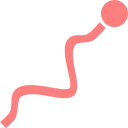

# Grappling Hook Addon

Grappling hook addon is a simple yet very customizable addon,
that allow you to implement grappling hook mechanic in your game
just by adding a HookController node to your player scene

 

## ⏬ Installation

- In Godot editor, open AssetLib tab
- Search "Grapple Hook 3D"
- Click on the addon and press download
- Checkout res://addons/grappling_hook_3d/README.md to start using it

 

## ⛑️ Contributing
This is a solo project. Though, don't hesitate to open issues

 

## 🪪 License

> The MIT License (MIT)
> 
> **Copyright © 2023 LowRezCat (Ivan Resetnikov)**
> 
> Permission is hereby granted, free of charge, to any person obtaining a copy of this software and
> associated documentation files (the “Software”), to deal in the Software without restriction,
> including without limitation the rights to use, copy, modify, merge, publish, distribute,
> sublicense, and/or sell copies of the Software, and to permit persons to whom the Software is
> furnished to do so, subject to the following conditions:
> 
> The above copyright notice and this permission notice shall be included in all copies or 
> substantial portions of the Software.
> 
> ***THE SOFTWARE IS PROVIDED “AS IS”, WITHOUT WARRANTY OF ANY KIND, EXPRESS OR IMPLIED, INCLUDING BUT
> NOT LIMITED TO THE WARRANTIES OF MERCHANTABILITY, FITNESS FOR A PARTICULAR PURPOSE AND
> NONINFRINGEMENT. IN NO EVENT SHALL THE AUTHORS OR COPYRIGHT HOLDERS BE LIABLE FOR ANY CLAIM,
> DAMAGES OR OTHER LIABILITY, WHETHER IN AN ACTION OF CONTRACT, TORT OR OTHERWISE, ARISING FROM, OUT
> OF OR IN CONNECTION WITH THE SOFTWARE OR THE USE OR OTHER DEALINGS IN THE SOFTWARE.***

 

## ❤️ Donations
**Donations are *very* appreciated!**

